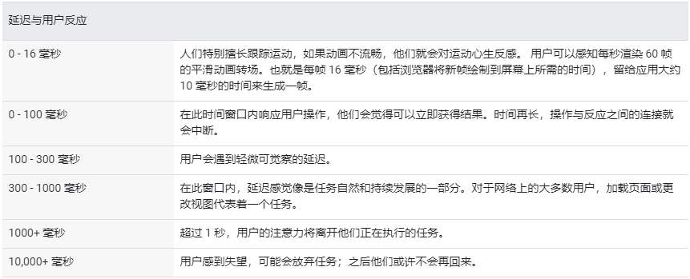
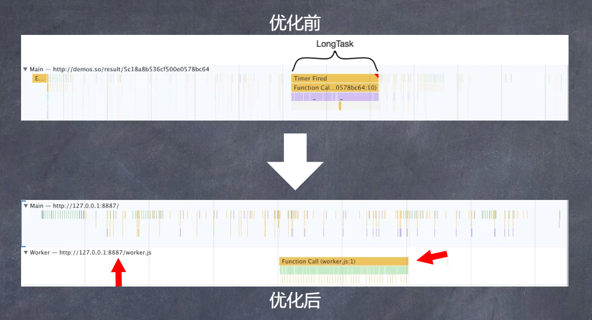

# 什么是时间分片（Time Slicing）？

根据[W3C性能小组](https://www.w3.org/webperf/)的介绍，超过50ms的任务就是长任务。



图片来自[使用 RAIL 模型评估性能](https://developers.google.com/web/fundamentals/performance/rail?hl=zh-cn)

根据上图我们可以知道，当延迟超过100ms，用户就会察觉到轻微的延迟。

所以为了避免这种情况，我们可以使用两种方案，一种是**Web Worker**，另一种是**时间切片（Time Slicing）**。

## Web Worker

我们都知道，JS是单线程，所以当我们在运行长任务时，容易造成页面假死的状态，虽然我们可以将任务放在任务队列中，通过异步的方式执行，但这并不能改变JS的本质。

所以为了改变这种现状，[whatwg](https://html.spec.whatwg.org/multipage/workers.html)推出了[Web Workers](https://html.spec.whatwg.org/multipage/workers.html)。

具体的语法不会进行说明，有兴趣的童鞋可以查看[MDN Web Worker](https://developer.mozilla.org/en-US/docs/Web/API/Web_Workers_API/Using_web_workers)。

我们可以看看使用了`Web Worker`之后的优化效果：

```javascript
const testWorker = new Worker('./worker.js')
setTimeout(_ => {
  testWorker.postMessage({})
  testWorker.onmessage = function (ev) {
    console.log(ev.data)
  }
}, 5000)

// worker.js
self.onmessage = function () {
  const start = performance.now()
  while (performance.now() - start < 1000) {}
  postMessage('done!')
}
```



代码以及截图来自于[让你的网页更丝滑](https://ppt.baomitu.com/d/b267a4a3)

## 时间切片（Time Slicing）

时间切片是一项使用得比较广的技术方案，它的本质就是将长任务分割为一个个执行时间很短的任务，然后再一个个地执行。

这个概念在我们日常的性能优化上是非常有用的。

例如当我们需要在页面中一次性插入一个长列表时（当然，通常这种情况，我们会使用分页去做）。

如果利用时间分片的概念来实现这个功能，我们可以使用`requestAnimationFrame`+`DocumentFragment`

关于这两个API，我同样不会做详细的介绍，有兴趣的可以查看[MDN requestAnimationFrame](https://developer.mozilla.org/en-US/docs/Web/API/window/requestAnimationFrame)跟[MDN DocumentFragment](https://developer.mozilla.org/en-US/docs/Web/API/DocumentFragment)。

这里有两个DEMO，大家可以对比下流畅程度：

未使用时间分片：

```html
<style>
    * {
        margin: 0;
        padding: 0;
    }
    .list {
        width: 60vw;
        position: absolute;
        left: 50%;
        transform: translateX(-50%);
    }
</style>
<ul class="list"></ul>
<script>
    'use strict'
    let list = document.querySelector('.list')
    let total = 100000
    for (let i = 0; i < total; ++i) {
        let item = document.createElement('li')
        item.innerText = `我是${i}`
        list.appendChild(item)
    }
</script>
```

使用时间分片：

```html
<style>
    * {
        margin: 0;
        padding: 0;
    }
    .list {
        width: 60vw;
        position: absolute;
        left: 50%;
        transform: translateX(-50%);
    }
</style>
<ul class="list"></ul>
<script>
    'use strict'
    let list = document.querySelector('.list')
    let total = 100000
    let size = 20
    let index = 0
    const render = (total, index) => {
        if (total <= 0) {
            return
        }
        let curPage = Math.min(total, size)
        window.requestAnimationFrame(() => {
            let fragment = document.createDocumentFragment()
            for (let i = 0; i < curPage; ++i) {
                let item = document.createElement('li')
                item.innerText = `我是${index + i}`
                fragment.appendChild(item)
            }
            list.appendChild(fragment)
            render(total - curPage, index + curPage)
        })
    }
    render(total, index)
</script>
```

没有做太多的测评，但是从用户视觉上的感受来看就是，第一种方案，我就是想刷新都要打好几个转，往下滑的时候也有白屏的现象。

除了上述的生成DOM的方案，我们同样可以利用Web Api `requestIdleCallback` 以及ES6 API  `Generator]`来实现。

同样不会做太多的介绍，详细规则可以看[MDN requestIdleCallback](https://developer.mozilla.org/zh-CN/docs/Web/API/Window/requestIdleCallback)以及[MDN Generator](https://developer.mozilla.org/en-US/docs/Web/JavaScript/Reference/Global_Objects/Generator)。

具体实现如下：

```html
<style>
    * {
        margin: 0;
        padding: 0;
    }
    .list {
        width: 60vw;
        position: absolute;
        left: 50%;
        transform: translateX(-50%);
    }
</style>
<ul class="list"></ul>
<script>
    'use strict'
    function gen(task) {
      requestIdleCallback(deadline => {
        let next = task.next()
        while (!next.done) {
          if (deadline.timeRemaining() <= 0) {
            gen(task)
            return
          }
          next = task.next()
        }
      })
    }
    let list = document.querySelector('.list')
    let total = 100000
    function* loop() {
      for (let i = 0; i < total; ++i) {
        let item = document.createElement('li')
        item.innerText = `我是${i}`
        list.appendChild(item)
        yield
      }
    }
    gen(loop())
</script>
```


## 参考资料

1. [web-performance](https://github.com/w3c/web-performance/)
2. [Measure Performance with the RAIL Model](https://developers.google.com/web/fundamentals/performance/rail)
3. [让你的网页更丝滑](https://ppt.baomitu.com/d/b267a4a3)
4. [「前端进阶」高性能渲染十万条数据(时间分片)](https://juejin.im/post/5d76f469f265da039a28aff7)


