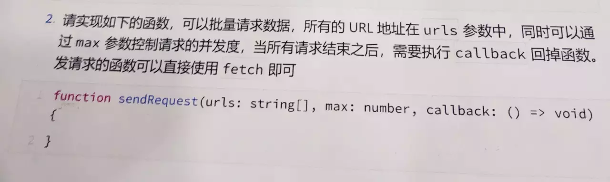
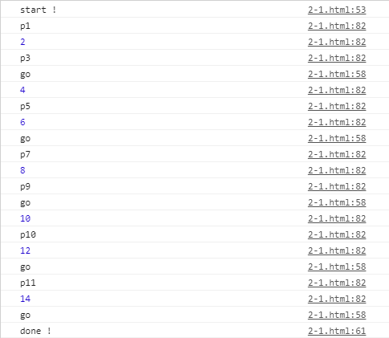

# 2. JavaScript实现指定数量的并发限制

在网上看到这么一道题：



这道题跟鱼头这篇记录『[什么是时间分片（Time Slicing）？](https://github.com/KRISACHAN/ying-study/issues/1)』有点相似，但不同的是这次是限制异步并发的数量。

所以话不多说，我们先来康康实现

首先我们来实现一个分割数组的函数~

```javascript
const group = (list = [], max = 0) => {
    let results = []
    for (let i = 0, len = list.length; i < len; i += max) {
        results.push(list.slice(i, i + max))
    }
    return results
}
```

这里就是根据指定的并发数量来分割数组。主要就是`for` + `slice`，这没啥好说的

接下来我们再来一个用`async` + `await`实现的请求集合封装。

我们通过`for...of`去遍历每一个异步函数，然后用`async` + `await`确保函数的执行顺序，再用`try...catch`来保证即使`reject`报错也不会导致无法继续执行任务。

```javascript
const requestHandler = async (
    groupedUrl = [],
    callback = () => {}
) => {
    let results = []
    for (let data of groupedUrl) {
        try {
            const result = await data().then(callback)
            results.push(result)
        } catch {}
    }
    return results
}
```

接下来就是主函数

```javascript
const sendRequest = async (
    urls = [],
    max = 0,
    callback = () => {}
) => {
    const { length } = urls
    const groupedUrls = group(urls, max)
    const results = []
    console.log('start !')
    for (let groupedUrl of groupedUrls) {
        try {
            const result = await requestHandler(groupedUrl, callback)
            results.push(result)
            console.log('go')
        } catch { }
    }
    console.log('done !')
    return results
}
```

这里就是利用了`for` + `async` + `await`来限制并发。等每次并发任务结果出来之后再执行下一次的任务。

我们执行下栗子：

```javascript
const p1 = () => new Promise((resolve, reject) => setTimeout(resolve, 1000, 'p1'))
const p2 = () => Promise.resolve(2)
const p3 = () => new Promise((resolve, reject) => setTimeout(resolve, 2000, 'p3'))
const p4 = () => Promise.resolve(4)
const p5 = () => new Promise((resolve, reject) => setTimeout(resolve, 2000, 'p5'))
const p6 = () => Promise.resolve(6)
const p7 = () => new Promise((resolve, reject) => setTimeout(resolve, 1000, 'p7'))
const p8 = () => Promise.resolve(8)
const p9 = () => new Promise((resolve, reject) => setTimeout(resolve, 1000, 'p9'))
const p10 = () => Promise.resolve(10)
const p11 = () => new Promise((resolve, reject) => setTimeout(resolve, 2000, 'p10'))
const p12 = () => Promise.resolve(12)
const p13 = () => new Promise((resolve, reject) => setTimeout(resolve, 1000, 'p11'))
const p14 = () => Promise.resolve(14)
const ps = [p1, p2, p3, p4, p5, p6, p7, p8, p9, p10, p11, p12, p13, p14]

sendRequest(ps, 3, result => {
    console.log(result)
    return result
})
```



OK，我们看到结果是如我们所愿的