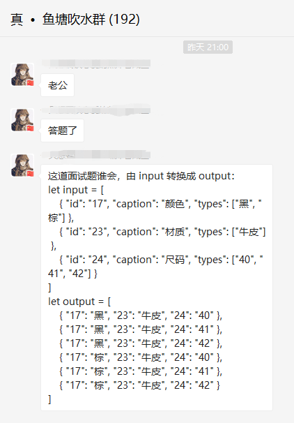

# 3. 一道排列组合的面试题

有人在群里问了这么一个问题：



问题如下：

```javascript
let input = [
    { id: '17', caption: '颜色', types: ['黑', '棕'] },
    { id: '23', caption: '材质', types: ['牛皮'] },
    { id: '24', caption: '尺码', types: ['40', '41', '42'] }
]

let output = [
    { "17": "黑", "23": "牛皮", "24": "40" },
    { "17": "黑", "23": "牛皮", "24": "41" },
    { "17": "黑", "23": "牛皮", "24": "42" },
    { "17": "棕", "23": "牛皮", "24": "40" },
    { "17": "棕", "23": "牛皮", "24": "41" },
    { "17": "棕", "23": "牛皮", "24": "42" }
]
```

一道排列组合题，也挺有意思的，有兴趣的可以来回答一波